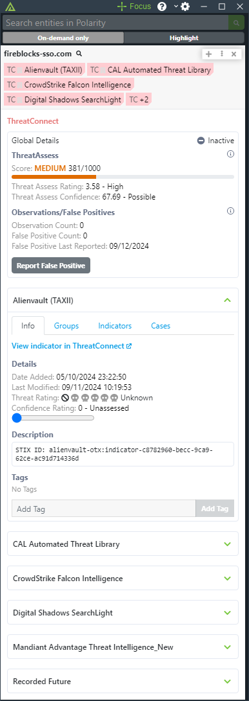
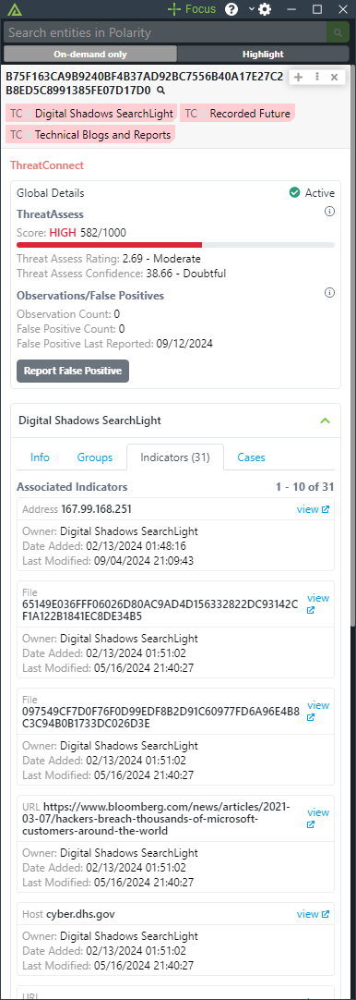

# Polarity ThreatConnect Integration

ThreatConnect is a security operations and analytics platform designed to allow teams to identify, manage, and block threats faster with intelligence.  For more information about ThreatConnect please visit:

https://threatconnect.com/

The Polarity ThreatConnect integration allows Polarity to search for address, file, host, and email indicators in ThreatConnect.  The Polarity-ThreatConnect integrations includes interactive elements that allow Polarity user's to add and remove tags, modify the severity and confidence level of an indicator, and report false positives directly from the Polarity Overlay Window.

|  |             |
|----------------------------|---------------------------------------|
| *ThreatAssess Details*     | *Associcated Indicators View* |

## ThreatConnect Integration Options

### ThreatConnect Instance URL

The URL of the ThreatConnect instance you would like to connect to (including http:// or https://).  If you are running an internal instance of ThreatConnect on a non-default port, please specify the port here as well.

### Access ID

Account Identifier that is associated with the API Key

### API Key

The API (secret) Key associated with the provided Access ID

### Search Inactive Indicators
If enabled, the integration will return indicators that are "inactive". Inactive indicators are not considered Indicators of Compromise and are kept for historical accuracy.

### Organization Search Blocklist

By default all organizations visible to the provided API User will be searched. This blocklist is a comma delimited list of organizations you do not want searched. This option cannot be used in conjunction with the "Organization Search Allowlist" option.

### Organization Search Allowlist 

By default all organizations visible to the provided API User will be searched. This whitelist is a comma delimited list of organizations you want searched (organizations not listed will not be searched). This option cannot be used in conjunction with the "Organization Search Blocklist" option

> Note that you cannot use both the Organization Search Allowlist and the Organization Search Blocklist.

## Installation Instructions

Installation instructions for integrations are provided on the [PolarityIO GitHub Page](https://polarityio.github.io/).

## Polarity

Polarity is a memory-augmentation platform that improves and accelerates analyst decision making.  For more information about the Polarity platform please see:

https://polarity.io/
